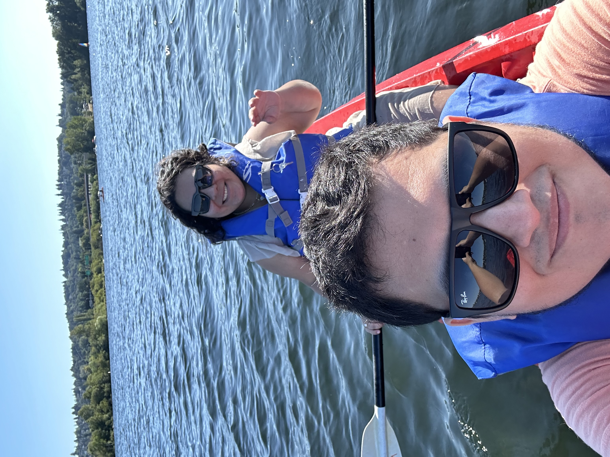
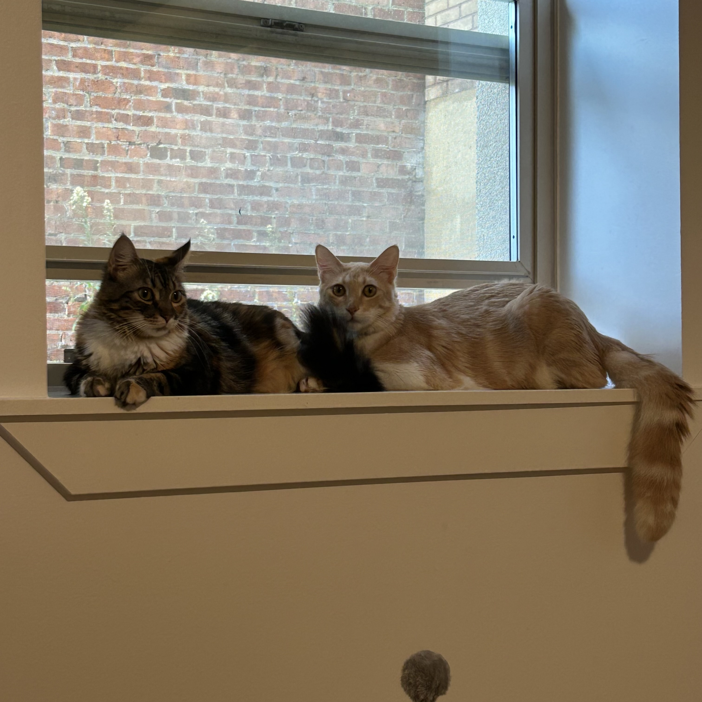

```{r, include=FALSE}
#| name: setup
#| message: FALSE
#| warning: FALSE
#| include: FALSE

knitr::opts_chunk$set(echo = FALSE)
source(file.path("R", "functions.R"))
library(distilltools)
```
<div style="text-align: justify; hyphens: auto;">
I am a Peruvian physician-scientist, epidemiologist, data analyst, musician, gamer, and a Master in Public Health candidate at University of Washington, Seattle in the [Department of Global Health](https://globalhealth.washington.edu/). My research focus is to understand the link between adverse experiences during pregnancy, the perinatal period, and infancy, and the development of cardiometabolic diseases during youth and young adulthood.

You can find more info about my background in my CV here: [CV](https://github.com/ddelcastillof/cv/blob/main/cv-ddcf.pdf) 
</div>

# Short Bio
{width=40% .external} \
<div style="text-align: justify; hyphens: auto;">
Darwin is a Peruvian Medical Doctor and a Master in Public Health candidate in the Department of Global Health at the University of Washington. His research focuses on understanding how maternal stressors during pregnancy and early life affect long-term cardiometabolic outcomes for children. He has extensive experience in epidemiological data analysis and healthcare data science in R and Stata languages. He speaks fluent Spanish and is trying to push hard to learn French with Duolingo ;). In his free time, he enjoys playing guitar, doing outdoor activities, playing with his two cats, and explore virtual worlds through viodegames. Darwin holds a M.D. from the Universidad Nacional Mayor de San Marcos, the oldest university in the American continent.
</div>

# Peru and Latin America
{width=80% .external} \
<div style="text-align: justify; hyphens: auto;">
During his medical training and early life years, Darwin was exposed to diverse underserved populations significantly affected by non-communicable diseases, many of these concurrently. Witnessing firsthand how social disparities ravaged families through limited healthcare access and poor health outcomes fueled his passion to understand the dynamics between social determinants of health and non-communicable diseases. His experiences with various populations across Peru enriched his perspective and reinforced his commitment to addressing health inequities through research.
</div>

# Outside academia
{width=40% .external} \
<div style="text-align: justify; hyphens: auto;">
An avid cat lover, he cherishes spending time at home with his two Peruvian feline companions. In his free time, he enjoys playing video games and engaging in outdoor activities with his fiancée.
</div>